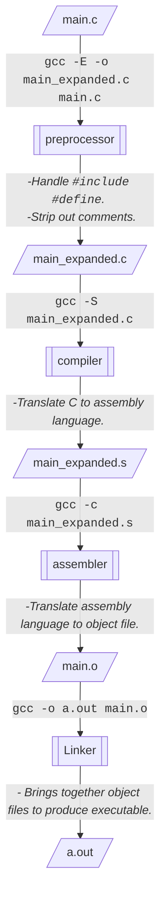
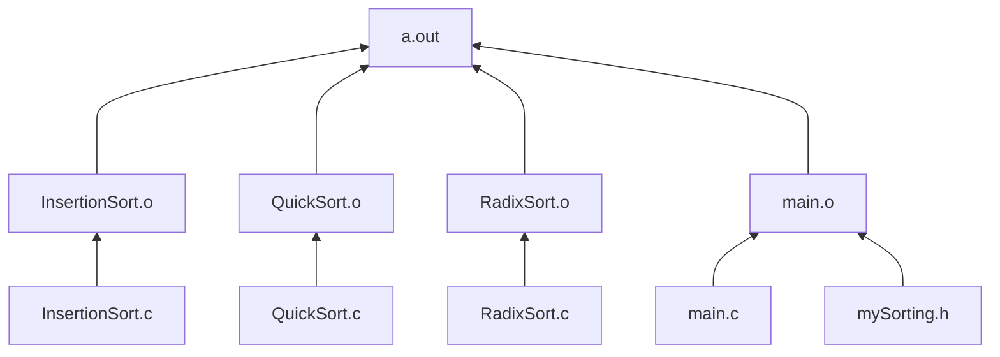
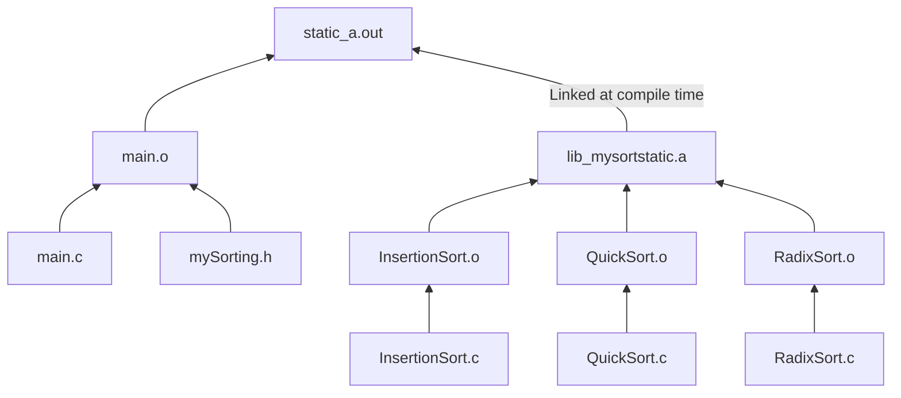
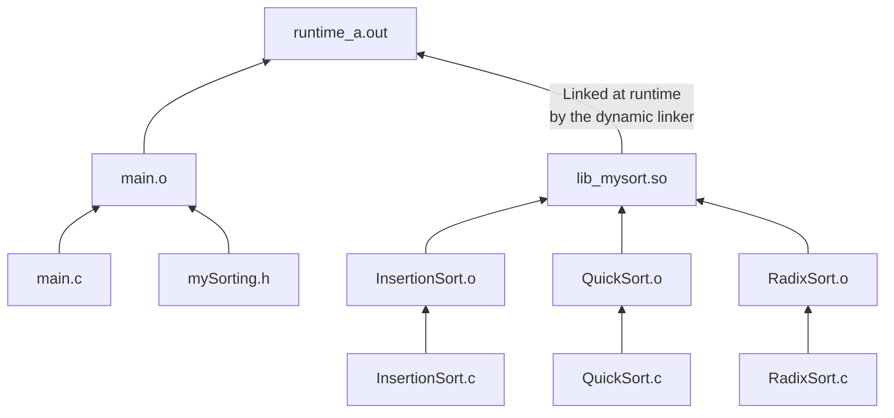

# Creation & application of libraries.
Libraries helps us to use a set of related functions and datas in multiple files. This way we would not have to rewrite the code for it in every new project. How they are used in our projects depends on the type of library. There are two types of libraries:
1. Static(Archive) Libraries.
2. Dynamic(Shared) Libraries 

Static libraries are linked with the program at compile time. The object code of the library is included in the object code of the program executable. So every new project using this type of library will have the library's object code included in its executable. This in turn will increase the size of the executable, when compared with the executable compiled using a dynamic version of the same library.

Dynamic libraries are linked with the program at runtime. Unlike static libraries a program referencing a shared library will not include the library object code in its resulting executable. Thus, we get smaller executable file. The shared object file needs to be placed at a location where the loader looks for, by default it looks at `usr/lib`. But we can also specify this as an environment variable (`$LD_LIBRARY_PATH`) to our program. To set the current location following command can be given:   
```bash
$LD_LIBRARY_PATH=.
```

## Steps involved in a C program compilation 
An executable file(`a.out`) can be compiled from a C-source code(`main.c`) with the following simple command:
```bash
gcc main.c
```
But actually this happens in stages; as shown below in the flowchart.The flowchart also illustrates the commands that can be used to generate output of each stage.

 This is the reason why sometimes compilers are known as toolchain, because of the chain of tools involved in the process of compilation. 
## Comparison of how an executable is genereated normally, with static libraries, and dynamic libraries.

The below flowchart illustrates how executable is generated normally(i.e., without any user defined libraries)

An executable generated with the help of a static library is show below. The object code of the library is included to the final executable at the compile stage (the stage after preprocessor and before assembler).

Finally, for dynamic libraries the executable will provide a reference to the library. And this will be used at the linker stage(the stage after assembler).

File size comparison(displayed below) makes it clear that the executable(`runtime_a.out`) run using dynamic library occupies less space compared to the others. Although, the size of the dynamic library(`lib_mysort.so`) is at least 5 KB more than the static library(`lib_mysortstatic.a`) 
| File | Size [bytes] | Description |
| :-----: | ----: | ---: |
| `a.out` | 23432 | Output file without any library. |
| `static_a.out` | 23432 | Output file using static library. |
| `runtime_a.out` | 20008 | Output file using dynamic library. |  
| `lib_mysort.so` | 20432 | Dynamic/(Shared object) library |
| `lib_mysortstatic.a` | 15106 | Static/Archive library |


Therefore, the static libraries can be used when we would not be requiring it in multiple files. And also when we know that the library is not going to be updated frequently static library is a good choice. For a library with that needs to be called into multiple files and frequently updated, dynamic files will be the best choice. 